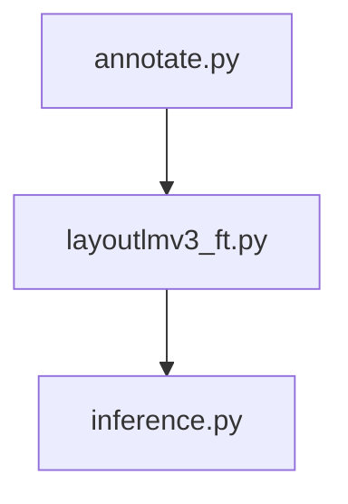
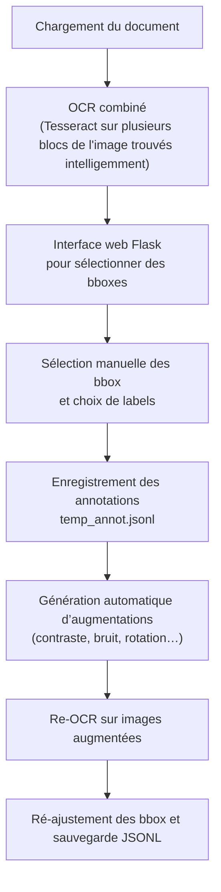

# Pipeline d'extraction d'informations dans les documents

Pipeline pour étiqueter vos documents (informations clés à extraire), augmenter vos données, affiner LayoutLMv3 dessus, effectuer des inférences sur de nouvelles données et visualiser les informations clés extraites ! Pas besoin de GPU pour entraîner et faire tourner le modèle final en inférence.

- 📄 **Peu de données nécessaires** : seulement une dizaine de documents à labéliser pour de bonnes performances.  
- 🎨 **Interface de labélisation intuitive** : créez tous les labels dont vous avez besoin, libre à vous de définir précisément les informations clés à extraire.  
- 🔍 **OCR ultra-performant** : détection “intelligente” des régions par gradient de Sobel pour un découpage optimal et une reconnaissance de texte de haute qualité.  
- 🔄 **Data augmentation** : générez automatiquement des variantes labélisées pour enrichir votre jeu de données et renforcer la robustesse du modèle.  
- 🤖 **Fine-tuning d’un Transformer multimodal léger** : adaptez facilement [layoutlmv3-base](https://huggingface.co/microsoft/layoutlmv3-base) de Microsoft à vos documents, sans GPU nécessaire.  
- 🖥️ **Interface d’inférence modulable** : visualisez directement les informations extraites, ou personnalisez librement le script `inference.py` pour exploiter vos résultats selon vos besoins. Encore une fois, pas de GPU nécessaire pour l'inférence! Utiliser le script simplement en local!


## Lancement de l'outil
```shell
make all
```
Si tu as un nom spécifique pour ton projet:
```shell
make NAME=mon_projet all
```
Si tu ne veux lancer que sur l'inférence car tu as déjà un modèle fine-tuné
```shell
make NAME=mon_projet final_inference
```

### Workflow de l’outil



## Introduction de la tâche KIE
Key Information Extraction (KIE) consiste à détecter et à extraire automatiquement des éléments structurés (champs-clés, entités, paires clé-valeur) à partir de documents variés (formulaires, factures, reçus, etc.). Il s'agit en fait d'une tâche de classification multi-classes des mots issus de l'OCR. 

### Jeux de données et exemples de tâches
- **FUNSD** (Form Understanding in Noisy Scanned Documents) : extraction de paires clé-valeur depuis des formulaires annotés avec positions de tokens et catégories sémantiques.
- **SROIE** (Scanned Receipt OCR and Information Extraction) : identification et classification des champs clés (nom du magasin, total, TVA, date) sur des reçus de caisse.
- **CORD** (Complex Receipt Datasets) : version détaillée de reçus permettant l’extraction d’informations plus diversifiées et la reconnaissance de tables.

Chaque dataset propose une **tâche de classification** (types de champs) et de **localisation** (boîtes englobantes), ou une **tâche générative** (générer directement le JSON de sortie).

Ici, je propose une tâche de KIE "custom", avec les documents & labels au choix!

### Familles de modèles pour la KIE
Deux grandes catégories de modèles s’affrontent sur ces tâches :

#### 1. Modèles fine-tunés (add heads)
- **Principe** : partir d’un backbone pré-entraîné (LayoutLMv3, Donut, etc.), ajouter une tête spécialisée (classification, token classification) et fine-tuner sur la tâche cible.
- **Atouts** : légers, rapides à entraîner (quelques heures sur CPU ou petite GPU), nécessitent peu de ressources matérielles.
- **Exemples** :
  - **LayoutLMv3** : modèle multimodal traitant conjointement les tokens textuels, la mise en page (bboxes) et l’information visuelle extraite via une architecture Transformer unifiée.
  - **LILT (TILT)** : extension de LayoutLM pour la génération de sorties structurées à partir de tokens visuels et textuels, souvent utilisée en mode discriminatif.
- **Usage typique** : classification de tokens, extraction de paires clé-valeur via softmax sur chaque token.

#### 2. Modèles génératifs (VLLMs)
- **Principe** : modèles de type « Vision + Language Large Models » qui reçoivent en entrée l’image du document et génèrent séquentiellement le JSON ou la liste des champs.
- **Atouts** : flexibles, peuvent gérer des sorties hétérogènes et imiter un assistant linguistique pour la documentation.
- **Exemple** :
  - **GenKIE** : génère directement les structures de sortie, robuste aux erreurs OCR.

> *Pour une revue détaillée des différentes familles de modèles KIE, voir le papier* [arXiv:2501.02235](https://arxiv.org/pdf/2501.02235).


## 1. annotate.py – Annotation interactive et génération de données



Dans **annotate.py**, on propose une application Flask permettant d’annoter **manuellement** des données visuelles en **sélectionnant** directement les bounding boxes détectées par OCR et en choisissant **librement** les labels (totalement customisables) :contentReference[oaicite:0]{index=0}:contentReference[oaicite:1]{index=1}.

- **But principal** : créer un fichier `temp_annot.jsonl` qui servira au **finetuning** du modèle KIE (LayoutLMv3 ou équivalent).  
- **OCR multicouche** : trois moteurs (EasyOCR, Tesseract, Docling) sont appliqués séquentiellement puis combinés sans chevauchement pour obtenir la reconstruction la plus **précise** possible des mots et de leurs boîtes :contentReference[oaicite:2]{index=2}:contentReference[oaicite:3]{index=3}.   
- **Annotation manuelle** :  
  - L’utilisateur sélectionne dans l’interface **toutes** les bounding boxes qu’il souhaite annoter, puis entre le label de son choix (100 % customisable).  
  - Le système génère automatiquement des **tags BIO** :  
    - `B-<LABEL>` pour le premier bbox d’une entité  
    - `I-<LABEL>` pour chaque bbox suivant  
  - **Exemple** : l’OCR a fragmenté le nom `Monsieur Patate LTD` en trois bboxes.  
    1. Sélectionner les trois  
    2. Choisir le label `NAME`  
    3. Stockage dans `temp_annot.jsonl` :  
    ```json
    [
      { "bbox": [[x1, y1, x2, y2], [x3, y3, x4, y4], [x5, y5, x6, y6]], "words": ["Monsieur" , "Patate" "LTD", "lives" "in", "Toulouse"], "label": ["B-NAME", "I-NAME", "I-NAME", "O", "O", "B-City"]}
    ]
    ```  
  - Si une même entité est éclatée en plusieurs morceaux par l’OCR, il suffit de sélectionner **tous** les morceaux pour qu’ils soient étiquetés ensemble (l'un après l'autre, avant de valider la labélisation); l’utilisateur clique-glisse pour sélectionner **toutes** les boxes formant une entité (même si l’OCR l’a découpée en plusieurs morceaux) et lui associe un label. Le système génère automatiquement des tags **BIO** („B-” pour le début, „I-” pour la suite).  
   - Exemple : pour un nom en 3 boxes (« Monsieur » « Patate » « LTD »), on sélectionne les trois, on choisit le label `NAME` et on obtient dans `temp_annot.jsonl` :  
     ```json
     ["B-NAME", "I-NAME", "I-NAME"]
     ```  
  - Note que le label "O" sert de "N/A" (non-applicable). Ce sont les mots du documents qu'on n'a pas labélisés. Eh oui, parce que la tâche de KIE sur des documents est en fait une tâche de token classification, cad qu'il faut classifier CHAQUE token, même si tous les tokens ne nous intéressent pas!   
- **Augmentation et réajustement** : une fois les annotations sauvegardées dans `temp_annot.jsonl` (via le bouton **Save to Annotation File**), annotate.py applique des transformations d’image (contraste, bruit, rotation légère, perspective, taches d’encre, etc.), relance l’OCR sur chaque image modifiée, et **réajuste** les annotations par transfert de labels basé sur la similarité de texte :contentReference[oaicite:4]{index=4}:contentReference[oaicite:5]{index=5}.  
  1. Application de transformations d’image (contraste, bruit, rotation, perspective, taches…)  
  2. Nouvelle passe OCR sur chaque image modifiée  
  3. Transfert automatique des labels : rapprochement des textes pour **réajuster** les bboxes  
- **Sortie finale** : le fichier `temp_annot.jsonl`, normalisé pour LayoutLMv3 (bboxes à l’échelle 0–1000), servira ensuite de jeu de données pour le **finetuning** du modèle KIE.

---


## 2. Fine-tuning du modèle multimodal (LayoutLMv3)
- **Lancer le script** :
```shell
python layoutlmv3_ft/layoutlmv3_ft.py
```
- Chargement du backbone :
    - Tokens textuels issus de l’OCR
    - Boîtes englobantes (bboxes normalisées)
    - Features visuelles extraites de l’image
- Tête spécialisée : classification de token pour extraire les paires clé-valeur
- Hyperparamètres : configurables via configs/layoutlmv3_config.yaml (learning rate, batch size, epochs)
- Matériel :
    - CPU (multi-threading) ou petite GPU (CUDA minimale)
    - Durée typique : ~2–4 h sur CPU, <1 h sur GPU modeste
- Sortie : Poids sauvegardés dans results/final_model/model.safetensors

---

## 3. inference.py – Chargement du modèle fine-tuned et prédictions

Le script **inference.py** ne fonctionne **qu’après** le fine-tuning lancé dans le dossier `layoutlmv3_ft` (après clic sur **Finish and clean** dans annotate.py, on exécute le notebook/train script qui produit `results/final_model`) :contentReference[oaicite:6]{index=6}:contentReference[oaicite:7]{index=7}.  
1. **Chargement du modèle** : on récupère `label_mappings.json` et le modèle LayoutLMv3ForTokenClassification entraîné, via `LayoutLMv3Processor` (avec OCR désactivé), sur le device CPU/GPU disponible :contentReference[oaicite:8]{index=8}:contentReference[oaicite:9]{index=9}.  
2. **Pipeline de prédiction** :  
   - Téléversement d’une image via l’interface Flask.  
   - **OCR combiné** : Docling d’abord, puis Tesseract pour ajouter les mots manquants.  
   - **Normalisation** des boîtes au format 0–1000 attendu par LayoutLMv3.  
   - **Inférence** : passage dans le modèle pour obtenir un label par token, puis agrégation des premiers tokens de chaque mot.  
3. **Post-traitement** :  
   - **Fusion BIO** : on regroupe séquentiellement les a

---


## Licence

Ce projet est distribué sous licence Apache 2.0. Voir le fichier [LICENSE](./LICENSE) pour les détails.